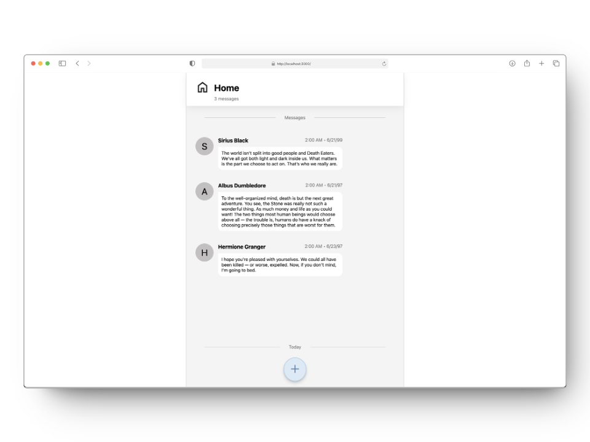

# 💬 Message Board

This is a simple message board application built with Express.js. Users can view messages and add new messages.

## Preview



## Installation

1. Clone the repository:

   ```bash
   git clone https://github.com/yourusername/mini-message-board.git
   ```

2. Navigate to the project directory:

   ```bash
   cd message-board
   ```

3. Install the dependencies:
   ```bash
   npm install
   ```

## Usage

1. Start the server:
   ```bash
   npm start
   ```
2. Open your browser and go to `http://localhost:3000` to view the app.

## Features

- View existing messages
- Add new messages

## License

This project is licensed under the MIT License.

```

```
